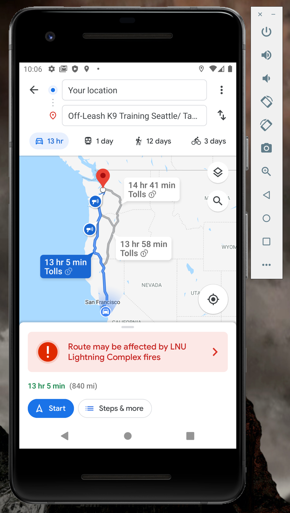
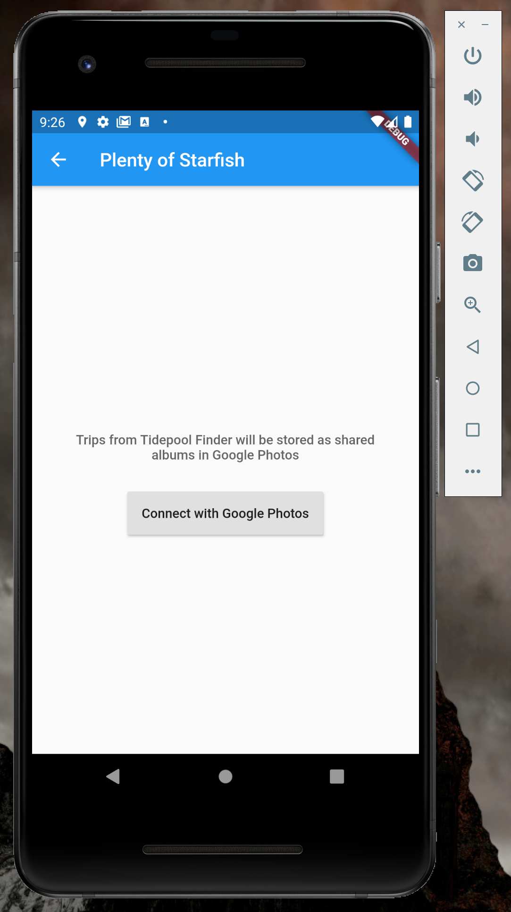

# Tide Pool Finder
Tide Pool Finder is an app designed to help users find great local sites to explore tide pools, take photos of what you find, and share those photos with others who are looking for great places to visit!

# Screenshots

The landing page currently offers four buttons.  Each implements a different Flutter package

## Plan Trip

The Plan Trip button loads a Google Maps widget with markers indicating locations of Seattle-area tide pools.  Clicking a map marker reveals a bottom sheet with:
- the beach's name
- its address
- a link to open that address in the Google Maps app
- a link to that beach's public website.

## Add Photo

Add Photo enables the user to add photos to their Tide Pool Finder album on their device.  They can choose to either take a photo in the app, or import an existing photo from their gallery.  

## View Photos

Clicking View Photos opens a scrollable carousel displaying photos from their Tide Pool Finder album.

## Share Photos

In the Share Photos section, the user can upload photos to albums in their Google Photos account and share those albums with other users!

OAuth screen

Login screen

Connection to Google Photos

Granting app permissions

Taking a photo

Viewing shared albums from other users

Creating a new album to share

Uploading photos to the new album
