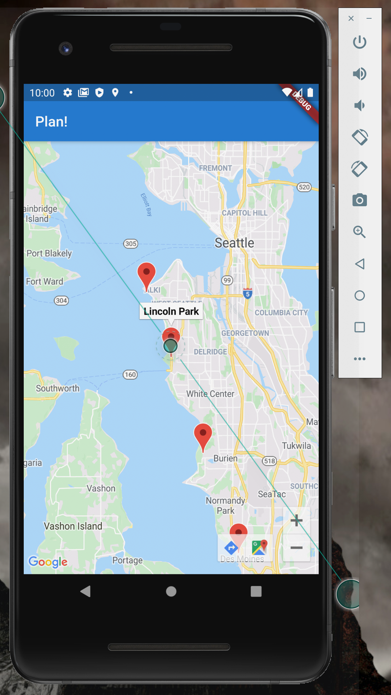

# Tide Pool Finder
Tide Pool Finder is an app designed to facilitate finding great local sites to explor tide pools, take photos of what you find, and share those photos with others who are looking for great places to visit!

This is the first mobile app I've written and my first time using Flutter & Dart, so to begin I've prioritized exploring how the language works and what packages are available over elegance.  For now, the app is divided into three sections that each explore a particular set of packages.  Two of them are based on tutorials available on Google Codelabs.  Eventually I would like them to seamlessly flow into one another so that users can quickly see photos of sites they're curious to visit and also view their own albuns in a fun carousel, but for now the three app sections don't interact with each other.

As mentioned above, the app draws heavily from tutorials available from the Flutter documentation and Google Code Labs.  The code in main.dart is my own, but the code in other files is primarily from outside sources with some edits.

After class is over, I will be collaborating with Ann Le from our parallel UX/UI course to improve the user experience, but for now I've focused on learning.

# Screenshots

The landing page currently offers three buttons.  Each implements a different Flutter package

## Plan a Trip

The Plan a Trip button loads a Google Maps widget showing locations of local tide pools.  Clicking a map marker reveals the location's name and displays buttons that will open the Google Maps app.

Clicking a map marker reveals the location's name and displays buttons that will open the Google Maps app.

## View Photo Carousel

Clicking View Photo Carousel open an infinitely-scrollable carousel of photos. For now, the app just displays hard-coded photos of my puppy.

## Share Your Photos

The Share Your Photos button connects the app to the user's Google Photos account.  In this section, the user can take photos with their phone's camera, log into their Google Photos account using OAuth, create albums to house their photos, and share those albums with other app users!

OAuth screen

Login screen

Connection to Google Photos

Granting app permissions

Taking a photo

Viewing shared albums from other users

Creating a new album to share

Uploading photos to the new album
