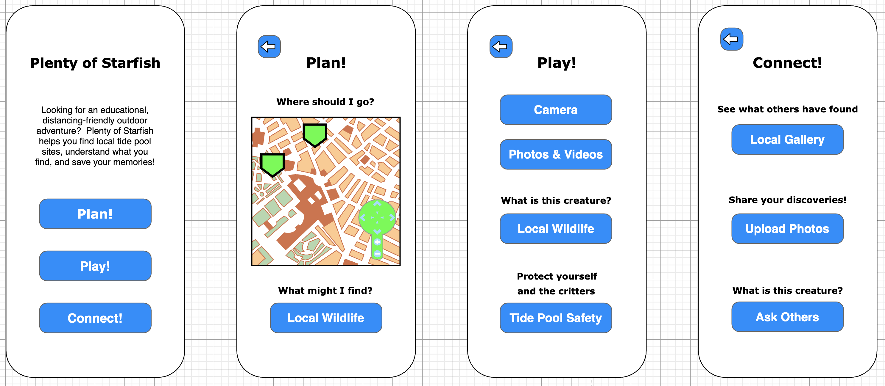

# Plenty of Starfish
a mobile app for nature exploration
***
## Project Team

- UX/UI: Ann Le

- Software Development: Eliott Davidson
***

## New Technology

- React Native or Flutter

***

## How do you plan on learning tech?
- Platform docs, online tutorials, and stack overflow

***

## What is your goal with this project?
- Lower the barrier to exploring & learning about local natural environments.  
- To start with, we'll focus on tide pools:  
    - Show the user where to find nearby sites to visit.  
    - Educate the user about what creatures they may encounter.  
    - Let the user take photos and share those photos with other local users.  
    - Let the user get help from other users IDing critters in their photos.  
- The core idea that got me thinking about this app was the possibility of making an app that would take user photos and convert those photos to coloring-book style drawings for kids to color in later, but that will probably end up being a side feature of the app, if it gets implemented at all.
- For MVP though, considering how difficult it may be to construct a mobile app at all, my goals would be: 
    - Make an app that loads
    - Give it a page that displays a map centered around the user
    - Give it a page that allows access to the phone's camera.

***

## Who is the user for this app?
- An adult who wants to explore something new outdoors that is social-distance-friendly, but who doesn't where to go.
- Parents who want to enrich their kids' COVID downtime

***

## Wireframes

***

## Potential roadblocks

- There are lots, but I think they're all ones that are important to my progress as a developer.
    - Learning to build a mobile app instead of a web one will probably be a very steep learning curve.  Educational resources may be limited and geared toward more seasoned developers.
    - Deployment will also probably be foreign & difficult
    - Learning how to gain permissions for & interact with the sophisticated systems within the phone will be challenging
    - The app would draw from a lot of different APIs for information about mapping, local sites to visit, local biodiversity, information about different species, and image processing.  Processing info from biodiversity APIs will be intense, but my background in biology may help. A local-sites-to-visit API may not even exist.
    - This project will be mirrored on my UX/UI designer's side as her Project 6, which may complicate things.  We plan to delay intense coordination until after graduation though, so I don't expect much difficulty there.
- For P4 MVP I think I should minimize content and go for features (display map, use camera).
- In the medium term (September/October) I think I should flesh out hard-coded sample content.
- In the long term , I think I should deepen/automate one feature at a time as time allows.

***

## Timeline:
- Fri 8/4 - Sat 8/6: Learn mobile development framework to the point where a landing page will display a title.  Check in with UX/UI.
- Sun 8/7: Add buttons that link to three other stubbed pages.  Begin learning about permissions.  Check in with UX/UI.
- Mon 8/8: Add a map centered around the user's location.  Check in with UX/UI.  Begin styling and adding minimal sample content.
- Tue 8/9: Add camera access, debug, or continue styling & sample content as time alllows.